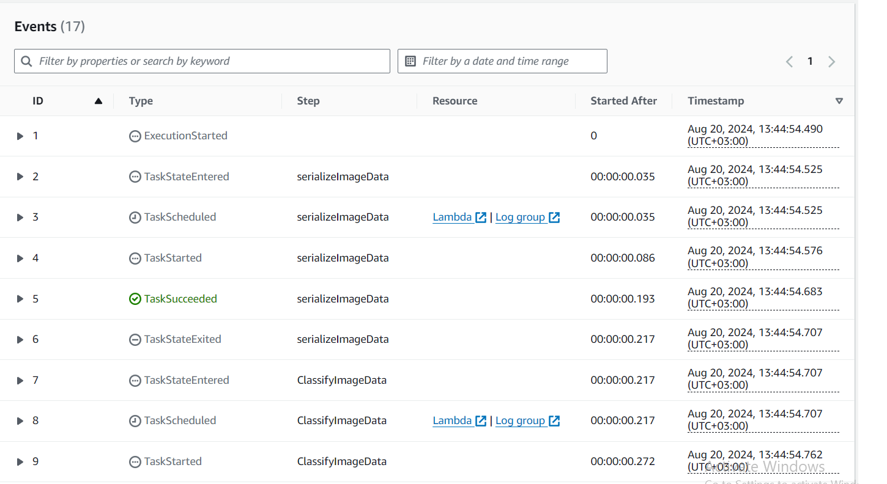
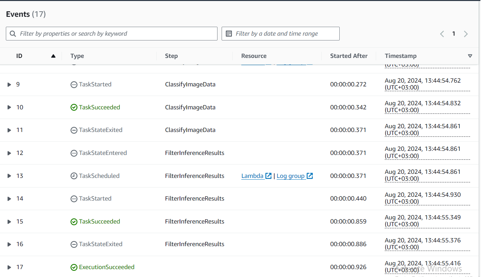
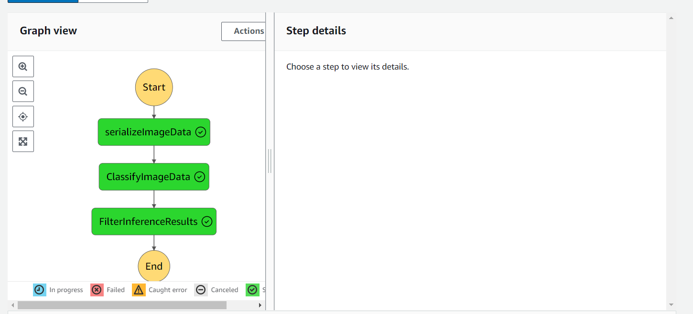
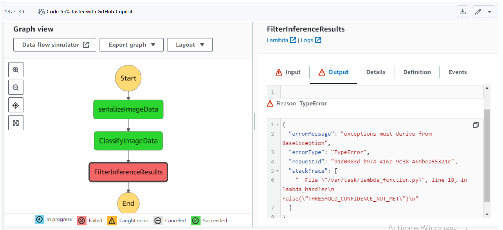

# Build a ML Workflow For Scones Unlimited On Amazon SageMaker
 
 # Project Overview:
 
 Image Classifiers are used in the field of computer vision to identify the content of an image and it is used across a broad variety of industries, from advanced technologies like autonomous vehicles and augmented reality, to eCommerce platforms, and even in diagnostic medicine.\\ In this project, I built an image classification model that can automatically detect which kind of vehicle delivery drivers have, in order to route them to the correct loading bay and orders. Assigning delivery professionals who have a bicycle to nearby orders and giving motorcyclists orders that are farther can help Scones Unlimited optimize their operations.
 
 # Project Steps Overview:
 
 * Step 1: Data staging
 * Step 2: Model training and deployment
 * Step 3: Lambdas and step function workflow
 * Step 4: Testing and evaluation
 * Step 5: Optional challenge
 * Step 6: Cleanup cloud resources
 
 # Building a State Machine via AWS Step Functions:
 
 * Execution Flow of the Step Function

* Step Function Graph(Met the threshold) :

* Step Function Graph(Not met the threshold) :

 

 
 
